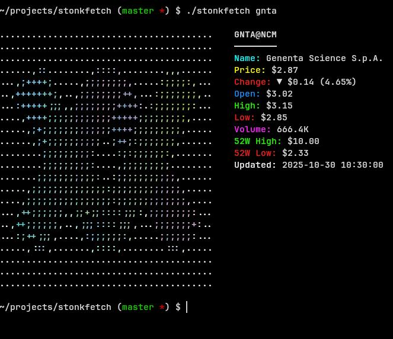

# stonkfetch

A Python CLI that shows real-time stock info with an ASCII-rendered company logo, inspired by neofetch.

---



---

## Features
- Real-time data from Yahoo Finance: price, volume, market cap, and 52-week range.
- Colored ASCII logos with Pillow; fallback ASCII otherwise.
- Automatic logo fetching via Clearbit and UpLead.
- Customizable colors and ASCII width; built-in domain mapping for 50+ symbols.
- **Watch mode**: Continuously monitor stocks with automatic updates at specified intervals.

## Requirements
- Python 3.6+ (or newer)
- Optional: Pillow for colored ASCII output

## Quick start
> Clone or download the script

```
git clone https://github.com/deechtejoao/stonkfetch && cd stonkfetch
```
> Make it executable (Unix-like)

```
chmod +x stonkfetch
```
> Optional: install Pillow for colored ASCII

```
pip install Pillow
```

## Installation
```
# Option A: Run locally from the repo
./stonkfetch AAPL

# Option B: Move to PATH for global use
sudo mv stonkfetch /usr/local/bin/stonkfetch
stonkfetch AAPL
```

## Usage
```
# Basic
./stonkfetch AAPL

# Syntax
./stonkfetch <symbol> [options]
```

- The `<symbol>` is a stock ticker like `AAPL`, `TSLA`, or `MSFT`.

## Options
- `--no-color` — disable all colored output
- `--no-color-ascii` — disable colors in ASCII art only
- `--no-logo` — skip logo fetching and use fallback ASCII
- `--ascii-width <n>` — set ASCII width (default: 40)
- `--watch <seconds>` — continuously update display every N seconds (press Ctrl+C to exit)
- `--version` — show version
- `-h, --help` — show help

## Examples
```
# Apple with colors
./stonkfetch AAPL

# Tesla with grayscale ASCII (text colors kept)
./stonkfetch TSLA --no-color-ascii

# Microsoft without logo (fallback ASCII)
./stonkfetch MSFT --no-logo

# Google with custom ASCII width
./stonkfetch GOOGL --ascii-width 50

# Amazon with no colors at all
./stonkfetch AMZN --no-color

# Watch mode: update every 5 seconds (press Ctrl+C to exit)
./stonkfetch AAPL --watch 5

# Watch mode with custom interval
./stonkfetch TSLA --watch 10

# Watch mode works with other options
./stonkfetch MSFT --watch 3 --no-logo
```

## How it works
- Fetches stock data from Yahoo Finance.
- Retrieves company logos from Clearbit or UpLead.
- Converts logos to colored ASCII when Pillow is available.
- Renders the logo on the left with formatted stock details on the right.

## Output
- Left: company logo as ASCII.
- Right: symbol/exchange, company name, price/change, open/high/low, volume, market cap, 52-week high/low, last update.

## Symbols
- Includes built-in domain mappings for popular tech, finance, consumer, and SaaS tickers, and can derive a domain when a mapping is missing.

## Dependencies
- Standard library: `argparse`, `json`, `urllib.request`, `datetime`, `typing`, `sys`, `re`, `time`, `signal`
- Optional: `Pillow` (for colored ASCII)

## Error handling
- Handles invalid symbols, network/API failures, missing Pillow, and malformed responses with informative messages.
## License
- MIT

